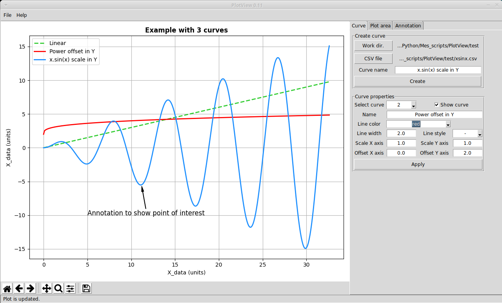

# PlotView
PlotView plots curves from CSV data file. The appearance of curves (color, line width, etc.) can be customized and one annotation can also be added if you need to highlight a point of interest.
ttk is used to have a more modern look at least on Windows platorms. Note that the below picture was taken on linux Xubuntu.
My goals are:
* Application to learn the basics of Python and simple GUI programming.
* Hopefully make a tool which will be useable to plot test data at work.

# Useful informations
The GUI will be make with **Tkinter** due to:
* *portability* to Linux & Windows
* *ease of programming* for a beginner
pandas and matplotlib allow to **process a lot of data points much faster than spreadsheet applications** (MS-Excel, LibreOffice Calc, etc.).
matplotlib *Figure* and *Navigation Tool Bar* will be embedded in tkinter GUI since it is not possible to update the matplotlib window in an interactive way.

## Expected CSV format
**Each file contain 1 curve** (X and Y coordinates for each point of the curve). The CSV file will be prepared beforehand, using pandas for example, to produce a **strict CSV format with a comma as delimiter between both columns**. The first row should contain the type of value for X and Y.

## Folders and files
* 'help' folder gathers HTML help files launched through the *help* menu.
* 'image' folder contains a few pictures of plot examples.
* 'test' folder contains a few test curves.
* plotview.py is the python script.
* PV_session.ini is a session file which enables to bring back a saved session: curves will be load, colors, titles and annotation are updated.

# Required Python packages.
PlotView needs the following packages to run.
* Python 3
* pandas 1.0.1
* matplotlib 3.2.0
* tkinter 8.6

Note that the above versions are those used for the development. If you have a lower version for a package, it may work. In case of trouble, please update the packages to these versions at least.

# Limitations of PlotView
* extensive tests are not yet done, so there is probably some bugs.
* one annotation can be created.

Enjoy !
